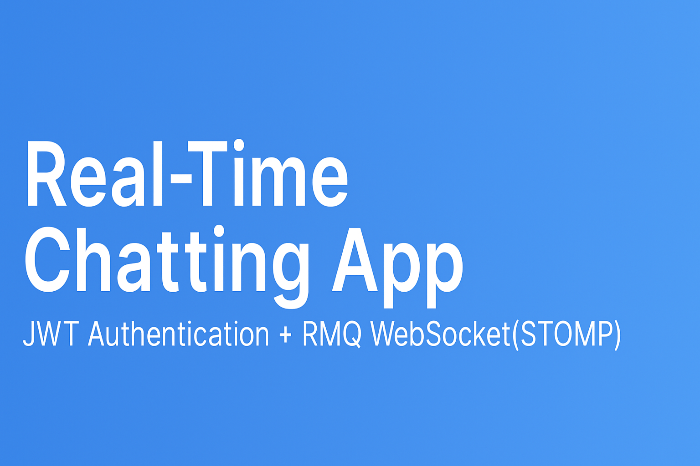
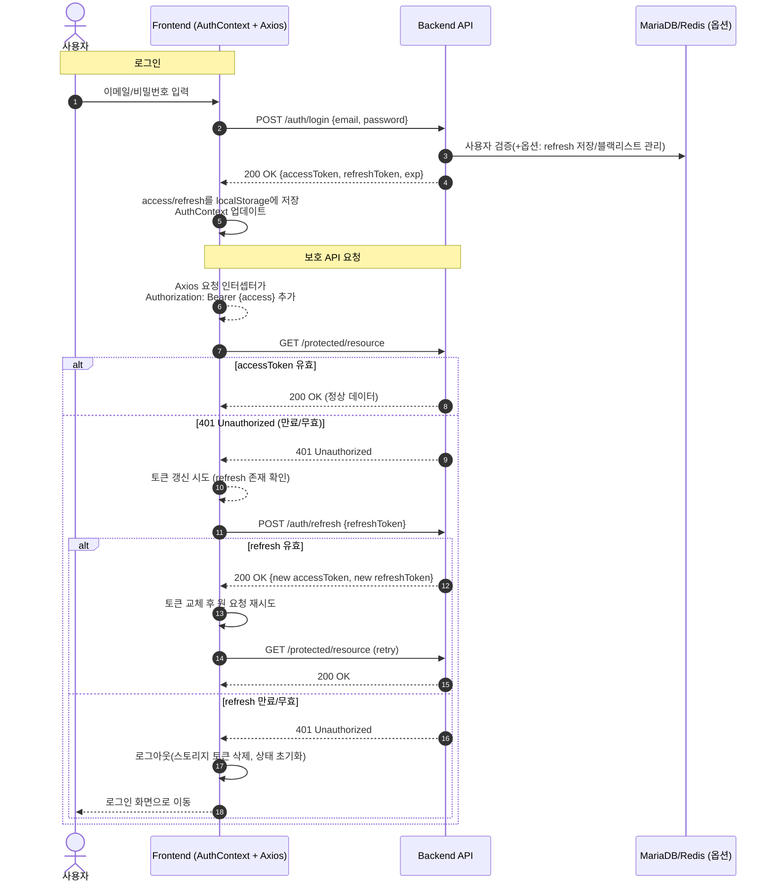
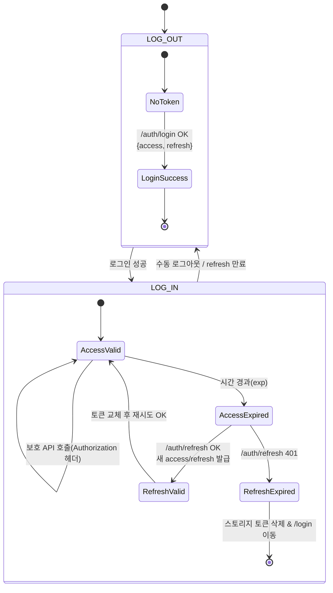
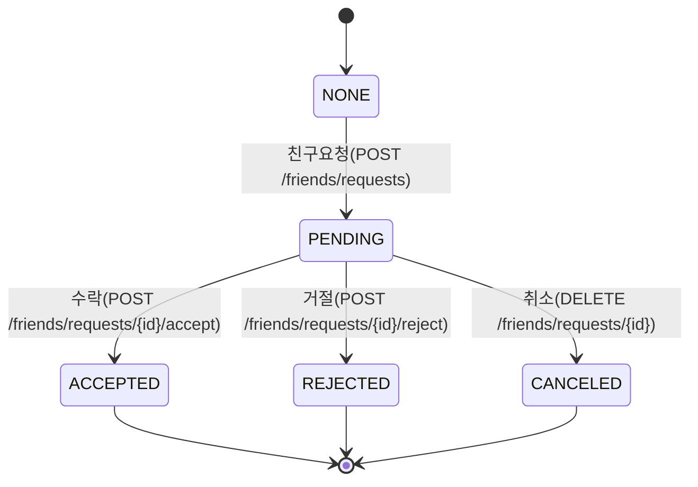
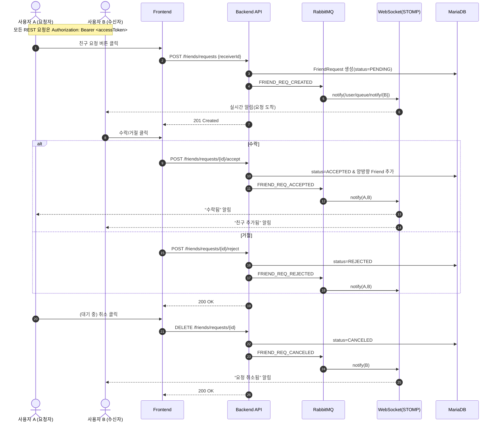
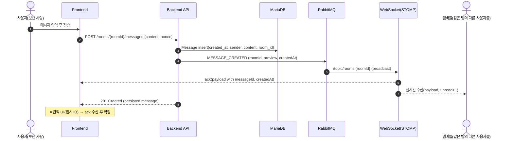
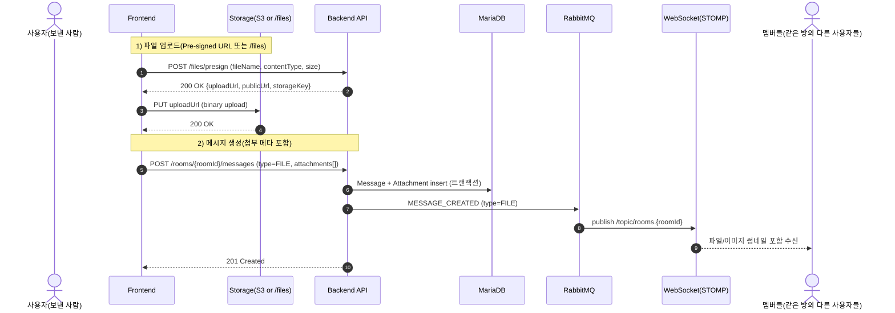
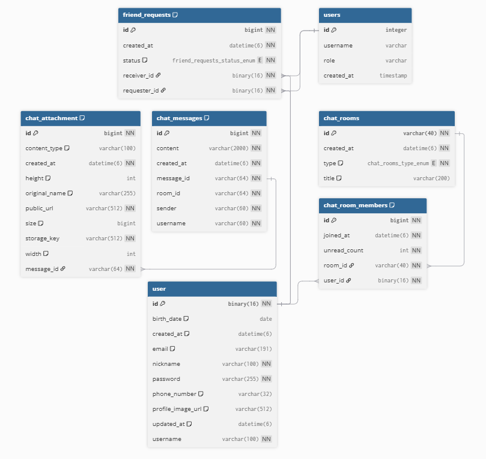
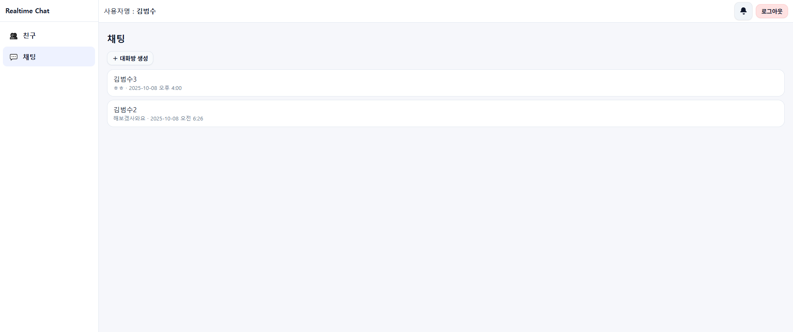
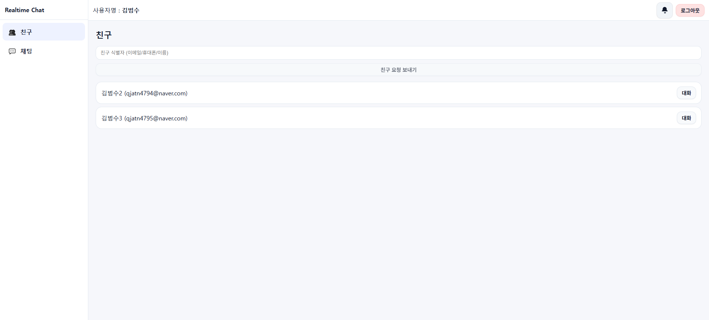

# 💬 Real-Time Chatting App

<p align="center">
  
</p>

Spring Boot + React Vite 기반의 **JWT 인증 + RMQ WebSocket(STOMP)** 실시간 채팅 애플리케이션입니다.  
사용자는 로그인 후 1:1/그룹 채팅방을 생성하여 메시지, 이미지, 파일을 실시간으로 주고받을 수 있습니다.

---

## 🚀 기술 스택

### Frontend
- React 18 + Vite + TypeScript
- Axios + React Context (JWT 관리)
- STOMP.js + SockJS (실시간 메시징)
- Tailwind / Custom CSS

### Backend
- Spring Boot 3.x
- Spring Security + JWT + Refresh Token
- Spring WebSocket + STOMP + RabbitMQ
- Spring Data JPA + MariaDB 10.11
- Redis (세션/토큰/캐싱)
- Gradle 8.x, Java 17

### Infra
- Docker Compose
    - `mariadb:10.11`
    - `rabbitmq:management`
    - `redis:7`

---

## ✨ 주요 기능

✅ 회원가입 / 로그인 / JWT 인증 및 자동 토큰 갱신  
✅ WebSocket 기반 실시간 채팅  
✅ 1:1 및 그룹 채팅방 생성 / 입장 / 퇴장  
✅ 메시지 기록 조회 및 무한 스크롤  
✅ 이미지 및 파일 첨부 (파일 서버 or public URL)  
✅ 읽지 않은 메시지(Unread) 카운트 및 알림  
✅ 초대 기능: 친구/사용자 초대 후 채팅방 합류  
✅ DB 최적화 (인덱스 적용: 메시지 조회, 방 멤버 검색)

---

## 🛠 실행 방법

### 1. Backend 실행
```bash
cd chatting-back
./gradlew bootRun
```

### 2. Frontend 실행
```bash
cd chatting-front
npm install
npm run dev
```

### 3. Docker Compose 실행
```bash
docker compose up -d
```

---

## 📂 프로젝트 구조

### Frontend (`chatting-front`)
```
chatting-front-vite/
├── public/                         # 정적 파일 (index.html, favicon, manifest 등)
├── src/
│   ├── api/                        # Axios 기반 API 호출 모듈 (백엔드 연동)
│   ├── attn/                       # (프로젝트 특화) Attention/알림 관련 모듈
│   ├── bootstrap/                  # 초기화 및 설정 코드 (앱 부트스트랩)
│   ├── components/                 # 공통 UI 컴포넌트 (버튼, 모달 등)
│   ├── context/                    # React Context (AuthContext 등 전역 상태 관리)
│   ├── hooks/                      # 재사용 가능한 React 커스텀 훅
│   ├── lib/                        # 유틸리티 라이브러리 (시간, 식별자, WebSocket 등)
│   ├── pages/                      # 주요 페이지 컴포넌트 (로그인, 채팅방, 친구목록 등)
│   ├── routes/                     # 라우팅 정의 (React Router 경로 매핑)
│   ├── styles/                     # 전역/페이지 CSS 스타일 파일
│   ├── types/                      # TypeScript 타입 정의 (DTO, 공용 타입 등)
│   ├── App.tsx                     # 메인 애플리케이션 컴포넌트 (라우팅/전역 레이아웃)
│   └── main.tsx                    # React 진입점 (root 렌더링)
├── .env                            # 환경 변수 설정 (API URL, WS 경로 등)
├── package.json                    # 프로젝트 의존성 및 실행 스크립트
└── Dockerfile                      # Docker 빌드 설정
```

### Backend (`chatting-back`)
```
chatting-back/
├── src/
│   ├── main/
│   │   ├── java/com/realtime/chatting/
│   │   │   ├── auth/               # Redis 세션 설정 파일
│   │   │   ├── chat/               # 채팅 관련 엔티티, 서비스, 컨트롤러
│   │   │   ├── common/             # 공통 유틸 파일
│   │   │   ├── config/             # 설정 파일 (WebSocket, JWT, RabbitMQ 등)
│   │   │   ├── chat/               # 채팅 관련 엔티티, 서비스, 컨트롤러
│   │   │   ├── login/              # 로그인 관련 엔티티, 레포지토리, 컨트롤러
│   │   │   ├── security/           # 보안 관련 설정 파일
│   │   │   ├── storage/            # 이미지/파일 업로드 관련 엔티티, 서비스, 컨트롤러
│   │   │   └── ChattingApplication.java # Spring Boot 진입점
│   │   └── resources/
│   │       ├── application.properties # 환경 설정 파일
│   └── test/                         # 테스트 코드
├── build.gradle                      # Gradle 빌드 설정
├── settings.gradle                   # Gradle 프로젝트 설정
└── Dockerfile                        # Docker Build 설정
```

---

## 🔑 인증 흐름




**엔드포인트 예시**
- 로그인: `POST /auth/login` → `{ accessToken, refreshToken, exp }`
- 토큰 갱신: `POST /auth/refresh` → `{ accessToken(new), refreshToken(new) }`
- 보호 API 호출: `Authorization: Bearer <accessToken>`
- 만료 처리:
    - access 401 → `refresh`로 갱신 시도 → 성공 시 원 요청 **자동 재시도**
    - refresh 401 → **로그아웃**(localStorage 토큰 삭제) → `/login` 이동

---

## 👥 친구 요청 플로우 (요청/수락/거절/취소)

### 상태 전이


### 시퀀스


**엔드포인트 예시**
- `POST /friends/requests` → `201 Created` (body: `{ id, requester, receiver, status: PENDING, createdAt }`)
- `POST /friends/requests/{id}/accept` → `200 OK` (서로의 친구목록 업데이트)
- `POST /friends/requests/{id}/reject` → `200 OK`
- `DELETE /friends/requests/{id}` → `200 OK`

> 권장: 같은 두 사용자 사이 **중복 PENDING 방지**(unique index), 요청자/수신자 검증, 자신에게 요청 금지, 이미 친구이면 차단

---

## 💬 메시지 전송/수신 플로우 (텍스트)



**구독/발행 규칙(예시)**
- Publish: `/app/chat.send` (서버 검증 후 브로커 전달 or REST 전용 → 서버가 publish)
- Subscribe: `/topic/rooms.{roomId}` (방 브로드캐스트), `/user/queue/notify` (개인 알림)

**권장 사항**
- **idempotency**: `nonce`(클라이언트 생성 UUID)로 중복 전송 방지
- **미리보기**: `preview=content.substring(0, N)` 캐싱 및 `room.lastMessageAt` 갱신
- **읽지 않음**: 서버에서 방 멤버별 `unread` 카운트 관리(수신 시 +1, 읽기 이벤트 시 0)

---

## 🖼️ 이미지/파일 메시지 플로우



**전송 포맷 예시**
```json
{
  "type": "FILE",
  "content": "",
  "attachments": [
    {
      "publicUrl": "https://cdn.example.com/2025/10/09/uuid.jpg",
      "storageKey": "2025/10/09/uuid.jpg",
      "originalName": "photo.jpg",
      "contentType": "image/jpeg",
      "size": 201234,
      "width": 1024,
      "height": 768
    }
  ]
}
```

**권장 사항**
- **보안**: 서버에서 파일 확장자/타입/크기 검증, 이미지 EXIF 제거, 악성 파일 검출
- **서명 URL**: 짧은 만료시간 + 1회성 권장, 최종 전파는 `publicUrl`만
- **썸네일**: 업로드 후 리사이즈(서버/워커) → 프론트는 저용량 우선 렌더
- **실패 복구**: 업로드 성공·메시지 실패 시 **가비지 수거**(주기 청소), 재시도 큐
- **진행률**: `XMLHttpRequest.onprogress` 또는 `fetch streams`로 업로드 UI

---

## ⚡ DB 구조 & 최적화

### ERD
<p align="center">
  
</p>

### 인덱스 적용 예시
```sql
-- 메시지 최신순 조회 인덱스
CREATE INDEX idx_chat_message_room_created_at
    ON chat_message (room_id, created_at DESC);

-- 방 멤버 조회 인덱스
CREATE INDEX idx_chat_room_member_user
    ON chat_room_member (user_id, room_id);
```

---

## 🔑 로그인 화면

<p align="center">
  
</p>

---

## 👥 친구목록 화면

<p align="center">
  
</p>

---

## 💬 채팅목록 화면

<p align="center">
  
</p>

---

## 🖼️ 채팅방 화면

<p align="center">
  
</p>

---

## 📌 TODO / 개선 예정

- [ ] 알림(Notification) Push 서버 연동 (FCM, WebPush)
- [ ] 파일 업로드 → AWS S3 연동
- [ ] DM/Group 채팅방 검색 기능
- [ ] 메시지 읽음 처리(Seen 상태) 표시
- [ ] 테스트 코드 (JUnit, Cypress)

---

## 👤 작성자

- Backend & Infra: Spring Boot, JPA, Redis, RabbitMQ, MariaDB
- Frontend: React, Vite, TypeScript  
